# LearningAier Architecture

## System Architecture Diagram

```mermaid
flowchart TB
    subgraph Client["Client Layer"]
        Browser["🌐 Web Browser<br/>(Chrome, Safari, etc.)"]
    end

    subgraph Frontend["Frontend Layer<br/>(Local: 5173)"]
        React["⚛️ React + Vite<br/>TypeScript"]
        TanStack["🔄 TanStack Query<br/>(React Query)"]
        MUI["🎨 Material UI<br/>Components"]
        ReactRouter["🛣️ React Router<br/>Navigation"]
    end

    subgraph Backend["Backend Layer<br/>(Local: 8787)"]
        FastAPI["🚀 FastAPI<br/>Python 3.11+"]
        Auth["🔐 Auth Middleware<br/>(Firebase ID Token)"]
        
        subgraph API["API Routes"]
            NotesAPI["📝 /api/notes"]
            DocsAPI["📄 /api/documents"]
            FlashcardsAPI["🎴 /api/flashcards"]
        end
        
        subgraph Services["Business Logic"]
            LLMService["🤖 LLM Service<br/>(Gemini)"]
            VectorService["🔍 Vector Service<br/>(Pinecone)"]
            RAGService["📚 RAG Service<br/>(Q&A Pipeline)"]
            PDFService["📑 PDF Parser"]
            NoteService["📝 Note Service"]
            DocService["📄 Document Service"]
        end
    end

    subgraph GoogleCloud["Google Cloud Platform"]
        subgraph Firebase["Firebase Services"]
            FirebaseAuth["🔑 Firebase Authentication<br/>(User Identity)"]
            Firestore["🗄️ Firestore Database<br/>(NoSQL)"]
            CloudStorage["💾 Cloud Storage<br/>(Files & PDFs)"]
        end
        
        GeminiAPI["🧠 Google Gemini API<br/>(LLM & Embeddings)"]
    end

    subgraph External["External Services"]
        Pinecone["📊 Pinecone<br/>(Vector Database)<br/>Index: learningaier-chunks"]
    end

    %% Client to Frontend
    Browser -->|HTTP/HTTPS| React

    %% Frontend Components
    React --> TanStack
    React --> MUI
    React --> ReactRouter
    
    %% Frontend to Backend
    TanStack -->|"REST API<br/>Bearer Token"| FastAPI
    
    %% Backend Flow
    FastAPI --> Auth
    Auth -->|"Verify Token"| FirebaseAuth
    Auth --> API
    
    %% API to Services
    NotesAPI --> NoteService
    NotesAPI --> RAGService
    DocsAPI --> DocService
    FlashcardsAPI --> NoteService
    
    %% Services to External
    NoteService --> Firestore
    DocService --> Firestore
    DocService --> CloudStorage
    DocService --> PDFService
    
    RAGService --> VectorService
    RAGService --> LLMService
    
    LLMService -->|"Chat & Embeddings"| GeminiAPI
    VectorService -->|"Similarity Search"| Pinecone
    
    %% Storage connections
    CloudStorage -.->|"PDF Files"| PDFService
    Firestore -.->|"Notes, Documents,<br/>Flashcards"| Services

    %% Styling
    classDef frontend fill:#61DAFB,stroke:#282C34,stroke-width:2px,color:#000
    classDef backend fill:#009688,stroke:#004D40,stroke-width:2px,color:#fff
    classDef firebase fill:#FFA000,stroke:#F57C00,stroke-width:2px,color:#000
    classDef external fill:#7C4DFF,stroke:#5E35B1,stroke-width:2px,color:#fff
    classDef client fill:#E0E0E0,stroke:#9E9E9E,stroke-width:2px,color:#000

    class Browser,Client client
    class React,TanStack,MUI,ReactRouter frontend
    class FastAPI,Auth,NotesAPI,DocsAPI,FlashcardsAPI,LLMService,VectorService,RAGService,PDFService,NoteService,DocService backend
    class FirebaseAuth,Firestore,CloudStorage,GeminiAPI firebase
    class Pinecone external
```



## Architecture Overview

### **Client Layer**
- **Browser**: User interface accessed via web browser
- Supports modern browsers with JavaScript enabled

### **Frontend Layer** (Port 5173)
- **Framework**: React 18 with Vite build tool
- **State Management**: TanStack Query (React Query) for server state
- **UI Library**: Material UI (MUI) for components
- **Routing**: React Router for navigation
- **Language**: TypeScript for type safety
- **Authentication**: Firebase Auth SDK with automatic token refresh

### **Backend Layer** (Port 8787)
- **Framework**: FastAPI (Python)
- **Authentication**: Firebase ID token verification middleware
- **Architecture**: Service-oriented design with separation of concerns

#### API Endpoints
| Route | Purpose |
|-------|---------|
| `POST /api/notes/ai-qa` | RAG-based Q&A over notes |
| `POST /api/notes/reindex` | Rebuild vector embeddings |
| `POST /api/documents/upload-process` | Process PDF documents |
| `POST /api/flashcards/*` | Flashcard generation & review |

#### Services Layer
- **LLM Service**: Handles Google Gemini API calls for chat and embeddings
- **Vector Service**: Manages Pinecone vector database operations
- **RAG Service**: Implements retrieval-augmented generation pipeline
- **PDF Service**: Parses PDF documents and extracts text
- **Note Service**: CRUD operations for notes
- **Document Service**: Document processing and storage

### **Google Cloud Platform**
#### Firebase Services
- **Authentication**: OAuth 2.0, Google Sign-In, Email/Password
- **Firestore**: NoSQL database for structured data
  - Collections: `notes`, `documents`, `flashcards`, `folders`
- **Cloud Storage**: Binary file storage
  - Buckets: `documents/{uid}/*.pdf`, `note-assets/{uid}/*`

#### Google AI
- **Gemini API**:
  - Model: `gemini-2.0-flash-exp` (chat & generation)
  - Embeddings: `text-embedding-004` (768 dimensions)

### **External Services**
#### Pinecone Vector Database
- **Index**: `learningaier-chunks`
- **Dimensions**: 768 (matching Gemini embeddings)
- **Metric**: Cosine similarity
- **Purpose**: Semantic search for RAG pipeline

## Data Flow

### 1. **User Authentication**
```
User → Frontend → Firebase Auth → Backend (Token Verification)
```

### 2. **Note Creation & Indexing**
```
User creates note → Frontend API → Backend → Firestore (save note)
                                          → LLM Service (generate embeddings)
                                          → Pinecone (store vectors)
```

### 3. **RAG Question Answering**
```
User asks question → Frontend → RAG Service → Pinecone (find similar chunks)
                                           → LLM Service (generate answer)
                                           → Frontend (display answer)
```

### 4. **PDF Document Processing**
```
User uploads PDF → Frontend → Cloud Storage (store file)
                           → Backend → PDF Service (parse text)
                                    → LLM Service (chunk & embed)
                                    → Pinecone (index chunks)
                                    → Firestore (save metadata)
```

## Technology Stack

### Frontend
- **React** 18.2 - UI framework
- **Vite** 5.2 - Build tool & dev server
- **TypeScript** 5.2 - Type safety
- **Material UI** 7.3 - Component library
- **TanStack Query** 5.90 - Data fetching & caching
- **React Router** 7.9 - Client-side routing
- **Firebase SDK** 12.6 - Authentication & Firestore client

### Backend
- **FastAPI** 0.115 - Web framework
- **Python** 3.11+ - Runtime
- **Pydantic** - Request/response validation
- **Firebase Admin SDK** - Server-side Firebase integration
- **PyPDF2** - PDF text extraction
- **Google Generative AI** - LLM operations

### Infrastructure
- **Firebase**:
  - Authentication
  - Firestore (NoSQL database)
  - Cloud Storage (file storage)
- **Google Gemini**: LLM & embeddings
- **Pinecone**: Vector similarity search
- **GitHub**: Version control
- **Docker**: Containerization (optional)

## Deployment Architecture

### Current (Development)
- **Frontend**: Local dev server (Vite) on port 5173
- **Backend**: Local uvicorn server on port 8787
- **Database**: Firebase Production (learningaier project)

### Proposed (Production)


## Security

### Authentication Flow
1. User signs in via Firebase Auth (frontend)
2. Frontend receives Firebase ID token
3. Token automatically included in API requests (Bearer header)
4. Backend verifies token with Firebase Admin SDK
5. User ID extracted from token for authorization

### API Security
- ✅ All endpoints require authentication
- ✅ Firebase ID token verification on every request
- ✅ User-scoped data access (uid-based filtering)
- ✅ CORS configuration for frontend domain
- ✅ Environment variables for API keys

## Performance Optimizations

### Frontend
- Code splitting with React Router
- TanStack Query caching & background refetch
- Lazy loading of components
- Optimistic UI updates

### Backend
- Async/await for all I/O operations
- Connection pooling for Firestore & Pinecone
- Batch operations for embeddings
- FastAPI automatic documentation & validation

## Monitoring & Observability

### Current
- Browser console for frontend debugging
- FastAPI auto-generated docs at `/docs`
- Environment configuration logging

### Recommended
- Firebase Analytics for user behavior
- Cloud Logging for backend errors
- Sentry for error tracking
- Pinecone metrics dashboard

## Future Enhancements

- [ ] Redis caching layer for frequent queries
- [ ] WebSocket support for real-time collaboration
- [ ] Background job queue (Celery) for long-running tasks
- [ ] Multi-tenant support with workspace isolation
- [ ] Advanced analytics dashboard
- [ ] Mobile app (React Native)
