# LearningAier Architecture

## System Architecture Diagram

```mermaid
graph TB
    subgraph "Client Layer"
        Browser["🌐 Web Browser<br/>(React SPA)"]
    end
    
    subgraph "Firebase Hosting"
        StaticFiles["📦 Static Assets<br/>(HTML, JS, CSS)<br/>Firebase Hosting CDN"]
    end
    
    subgraph "Google Cloud Platform"
        subgraph "Cloud Run"
            API["⚡ FastAPI Backend<br/>Port 8080<br/>(Auto-scaling containers)"]
        end
        
        subgraph "Firebase Services"
            Auth["🔐 Firebase Auth<br/>(OAuth, Email/Password)"]
            Firestore["🗄️ Firestore<br/>(notes, documents,<br/>flashcards, profiles)"]
            Storage["📁 Cloud Storage<br/>(PDFs, Images)"]
        end
    end
    
    subgraph "External Services"
        Gemini["🤖 Google Gemini API<br/>gemini-2.0-flash-lite<br/>text-embedding-004"]
        Pinecone["🔍 Pinecone Vector DB<br/>768-dim embeddings<br/>Cosine similarity"]
    end
    
    Browser -->|HTTPS| StaticFiles
    Browser -->|ID Token in Bearer Header| API
    Browser -->|Direct SDK Calls| Auth
    Browser -->|Direct SDK Reads/Writes| Firestore
    
    API -->|Verify ID Token| Auth
    API -->|CRUD Operations| Firestore
    API -->|Upload/Download Files| Storage
    API -->|Chat & Embeddings| Gemini
    API -->|Query & Upsert Vectors| Pinecone
    
    classDef frontend fill:#4285F4,stroke:#1565C0,color:#fff
    classDef backend fill:#34A853,stroke:#0F9D58,color:#fff
    classDef firebase fill:#FFA000,stroke:#F57C00,color:#fff
    classDef external fill:#EA4335,stroke:#C5221F,color:#fff
    
    class Browser,StaticFiles frontend
    class API,Auth,Firestore,Storage firebase
    class Gemini,Pinecone external
```



## Architecture Overview

### **Client Layer**
- **Browser**: User interface accessed via web browser.
- **Frontend**: React 18 Single Page Application (SPA) built with Vite.
- **State Management**: TanStack Query for server state synchronization.
- **Authentication**: Firebase Auth SDK handles login and token management.

### **Backend Layer** (Cloud Run)
- **Service**: FastAPI (Python) running in Docker containers on Google Cloud Run.
- **Scaling**: Auto-scales from 0 to N instances based on traffic.
- **Security**: Verifies Firebase ID tokens on every request using Firebase Admin SDK.
- **Responsibilities**:
  - AI Orchestration (RAG, Translation, Flashcards)
  - Vector Database Management (Pinecone)
  - Complex Business Logic
  - PDF Processing

### **Data Layer**
- **Firestore (NoSQL)**: Single source of truth for application state.
  - `notes`: Bilingual markdown content.
  - `documents`: Metadata for uploaded files.
  - `flashcards`: Generated study materials.
  - `profiles`: User settings (e.g., preferred LLM model).
- **Cloud Storage**: Stores binary assets (PDFs, images).
- **Pinecone (Vector DB)**: Stores 768-dimensional text embeddings for semantic search.

### **AI Layer**
- **Google Gemini**:
  - **LLM**: `gemini-2.0-flash-lite` for text generation, translation, and reasoning.
  - **Embeddings**: `text-embedding-004` for converting text to vectors.

---

## Key Data Flows

### 1. User Authentication
```
User → Frontend (Firebase Auth SDK) → Firebase Auth Server
  → Returns ID Token
  → Frontend stores token (auto-refreshed)
  → All API calls include "Authorization: Bearer <token>"
  → Backend middleware verifies token via Firebase Admin SDK
  → Extracts user.uid for authorization
```

### 2. Note Creation & Indexing
```
User creates note
  → Frontend → Firestore (direct write via SDK)
  → Note saved with content_md_zh, content_md_en

User clicks "Reindex"
  → Frontend → POST /api/notes/reindex
  → Backend:
    1. Fetch note from Firestore
    2. Combine zh + en content
    3. Chunk text (500 chars, 25% overlap)
    4. Generate embeddings via Gemini (text-embedding-004)
    5. Delete old vectors from Pinecone
    6. Upsert new vectors with metadata
  → Frontend: Success notification
```

### 3. RAG Question Answering
```
User asks: "What are the key concepts?"
  → Frontend → POST /api/notes/ai-qa { question, note_id, top_k }
  → Backend (RAG Service):
    1. Generate query embedding via Gemini
    2. Query Pinecone with filters: { user_id, note_id } → Get top-5 chunks
    3. Construct prompt: "Context: [chunks]\\nQuestion: ...\\nAnswer:"
    4. Call Gemini LLM (gemini-2.0-flash-lite)
    5. Return answer + source chunks
  → Frontend: Display answer with source references
```

### 4. PDF Document Processing
```
User uploads PDF
  → Frontend → Cloud Storage (direct upload via Firebase SDK)
  → Frontend → POST /api/documents/upload-process { document_id, file_path }
  → Backend (Document Service):
    1. Download PDF from Cloud Storage to temp file
    2. Extract text via PyPDF2
    3. Create draft note in Firestore
    4. Chunk text
    5. Generate embeddings via Gemini
    6. Upsert vectors to Pinecone
  → Frontend: Success, navigate to new note
```

---

## Deployment Architecture

### Frontend
- **Platform**: Firebase Hosting
- **Build**: `npm run build` (Vite) produces static assets in `dist/`
- **CDN**: Assets distributed globally via Google's CDN
- **CI/CD**: GitHub Actions triggers on push to `main`

### Backend
- **Platform**: Google Cloud Run
- **Container**: Docker image based on `python:3.11-slim`
- **Registry**: Google Container Registry (GCR)
- **CI/CD**: GitHub Actions builds image, pushes to GCR, and deploys to Cloud Run
- **Configuration**: Environment variables managed via Cloud Run revision settings (secrets mapped from GitHub Secrets)

## Security Model

1. **Transport**: All traffic over HTTPS.
2. **Authentication**: Firebase Auth (OAuth/Email).
3. **Authorization**:
   - Frontend: Firestore Security Rules (row-level security).
   - Backend: ID Token verification + UID checks in business logic.
4. **Secrets**:
   - Frontend: Only public config (API keys are restricted by domain).
   - Backend: Service account credentials and API keys injected as environment variables.
