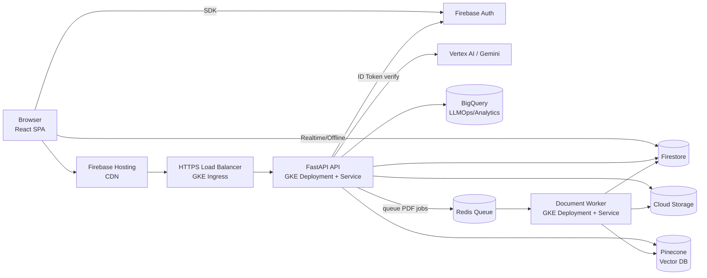
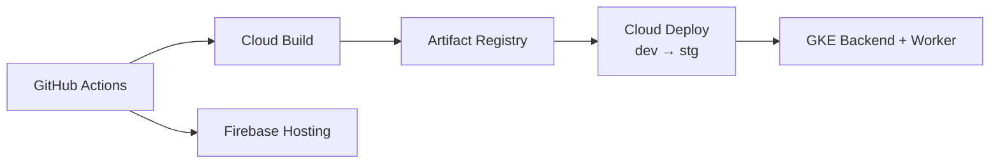
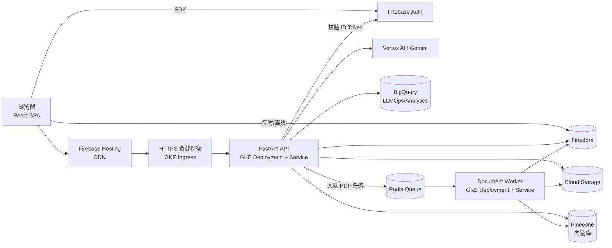

# LearningAier | AI Bilingual Learning & Memory Assistant

Language: [English](#english) | [中文](#中文)

> Portfolio-style overview of AI bilingual notes, RAG chat, flashcards with ML scheduling, PDF processing, knowledge graph, collaborative whiteboard, and analytics

## English

## Product Highlights
- 📝 Bilingual notes with AI translation and terminology extraction
- 🤖 RAG Q&A and streaming chat using Vertex AI / Google Gemini
- 🎴 Flashcards auto-generation + ML spaced-repetition scheduler (XGBoost/RandomForest)
- 📄 PDF upload → GKE Worker text extraction/embeddings → Pinecone retrieval
- 🕸️ Knowledge graph, collaborative whiteboard, pomodoro, and study tools
- 📊 BigQuery + LLMOps logging for cost, prompts, and behavior analytics

## Runtime Architecture



## Cloud & DevOps (Google Cloud + Firebase)



- GKE hosts the FastAPI backend, document Worker, and Redis queue (see `k8s/` and `record_debug/GKE_WORKER_ARCHITECTURE.md`)
- Cloud Build + Cloud Deploy pipeline defined in `clouddeploy.yaml` and `record_debug/CLOUD_BUILD_DEPLOY.md`
- Firebase covers Auth/Firestore/Storage; Pinecone handles vector retrieval; BigQuery captures LLM and learning analytics

## Tech Stack
- **Frontend**: React 18 + Vite 5 + TypeScript, Material UI 7, Tailwind, TanStack Query, Firebase SDK (Auth/Firestore/Storage), deployed on Firebase Hosting
- **Backend**: FastAPI (Python 3.11), Firebase Admin, Vertex AI / Gemini, Pinecone, XGBoost/RandomForest scheduler, deployed on GKE
- **Worker**: GKE Autopilot document microservice (FastAPI + Redis/ARQ) for PDF parsing and bulk embeddings
- **Data/ML**: text-embedding-004 (768 dims), Pinecone similarity search, BigQuery analytics

## Modules & Layout
```
.
├── frontend/                 # React web (pages, components, hooks, services, lib)
├── backend-fastapi/          # FastAPI API (app/api|services|core|models)
│   └── worker/               # Document/embedding Worker (Redis queue)
├── k8s/                      # GKE manifests (backend, worker, redis, ingress)
├── deploy-manifests/         # Infra manifests (GKE ingress, etc.)
├── clouddeploy.yaml          # Cloud Deploy pipeline (dev→stg)
├── record_debug/             # Architecture/ops notes and debug records
└── model.joblib              # Flashcard scheduling model
```

## Run Locally

### Frontend
```bash
cd frontend
npm install
# Create frontend/.env.local (example)
cat > .env.local <<'EOF'
VITE_FIREBASE_API_KEY=your_api_key
VITE_FIREBASE_AUTH_DOMAIN=your_project.firebaseapp.com
VITE_FIREBASE_PROJECT_ID=your_project_id
VITE_FIREBASE_STORAGE_BUCKET=your_project.appspot.com
VITE_FIREBASE_MESSAGING_SENDER_ID=your_sender_id
VITE_FIREBASE_APP_ID=your_app_id
VITE_FIREBASE_MEASUREMENT_ID=G-XXXXXXX
VITE_API_BASE_URL=http://localhost:8787
EOF
npm run dev
```
Dev server: `http://localhost:5173`

### Backend API (FastAPI / GKE equivalent)
```bash
cd backend-fastapi
python -m venv venv
source venv/bin/activate  # Windows: venv\\Scripts\\activate
pip install -r requirements.txt
cp .env.local.template .env.local   # Edit PORT, Firebase, Gemini, Pinecone as needed
uvicorn app.main:app --reload --port 8787
```
API: `http://localhost:8787` (Swagger: `/docs`)

### Document Worker (optional for local PDF queue)
```bash
# Requires local Redis (e.g., docker run -p 6379:6379 redis:7)
cd backend-fastapi
uvicorn worker.main:app --reload --port 8000
```
Point `REDIS_URL` to your Redis; production uses GKE + Redis Service.

## Deployment Snapshot
- **Frontend**: `npm run build`, deploy via Firebase Hosting (automated by GitHub Actions)
- **Backend API**: Cloud Build → Cloud Deploy → GKE backend deployment; config in `clouddeploy.yaml`
- **Worker**: Same pipeline to Artifact Registry; GKE Autopilot rolling updates (`k8s/worker-*.yaml`)
- **Environment Switching**: `backend-fastapi/DEPLOYMENT_ENVIRONMENTS.md` (local / lab / prod, Vertex AI vs Google AI)

## Key Docs (record_debug/)
- Architecture: `record_debug/ARCHITECTURE.md`
- GKE Worker: `record_debug/GKE_WORKER_ARCHITECTURE.md`
- CI/CD: `record_debug/CLOUD_BUILD_DEPLOY.md`
- Deployment & environments: `record_debug/backend_DEPLOYMENT_ENVIRONMENTS.md`, `record_debug/backend_DEPLOYMENT_SUMMARY.md`
- Local debugging: `record_debug/HOW_TO_RUN.md`, `record_debug/local_frontend_testing_guide.md`

## 中文

### 产品亮点
- 📝 中英文双语笔记，AI 翻译与术语抽取
- 🤖 基于 Vertex AI / Google Gemini 的 RAG 问答与流式聊天
- 🎴 闪卡自动生成 + ML 间隔重复调度（XGBoost/RandomForest）
- 📄 PDF 上传 → GKE Worker 提取文本/Embedding → Pinecone 检索
- 🕸️ 知识图谱、协作白板、番茄钟与学习工作台
- 📊 BigQuery + LLMOps 日志，覆盖成本、提示与行为分析

### 运行时架构



### 云与 DevOps（Google Cloud + Firebase）


- GKE 承载 FastAPI 后端、文档 Worker 与 Redis 队列（见 `k8s/` 与 `record_debug/GKE_WORKER_ARCHITECTURE.md`）
- Cloud Build + Cloud Deploy 流水线定义在 `clouddeploy.yaml` 与 `record_debug/CLOUD_BUILD_DEPLOY.md`
- Firebase 负责 Auth/Firestore/Storage，Pinecone 提供向量检索，BigQuery 记录 LLM 与学习行为分析

### 技术栈
- **Frontend**：React 18 + Vite 5 + TypeScript，Material UI 7，Tailwind，TanStack Query，Firebase SDK（Auth/Firestore/Storage），部署到 Firebase Hosting
- **Backend**：FastAPI（Python 3.11）、Firebase Admin、Vertex AI / Gemini、Pinecone、XGBoost/RandomForest 调度器，部署到 GKE
- **Worker**：GKE Autopilot 文档微服务（FastAPI + Redis/ARQ），负责 PDF 解析与批量 Embedding
- **Data/ML**：text-embedding-004（768 维）、Pinecone 相似度检索、BigQuery 分析

### 模块与目录
```
.
├── frontend/                 # React Web（页面、组件、hooks、services、lib）
├── backend-fastapi/          # FastAPI API（app/api|services|core|models）
│   └── worker/               # 文档/Embedding Worker（Redis 队列）
├── k8s/                      # GKE manifests（backend、worker、redis、ingress）
├── deploy-manifests/         # 基础设施 manifests（GKE ingress 等）
├── clouddeploy.yaml          # Cloud Deploy pipeline（dev→stg）
├── record_debug/             # 架构/运维笔记与排障记录
└── model.joblib              # 闪卡调度模型
```

### 本地运行

#### 前端
```bash
cd frontend
npm install
# 创建 frontend/.env.local（示例）
cat > .env.local <<'EOF'
VITE_FIREBASE_API_KEY=your_api_key
VITE_FIREBASE_AUTH_DOMAIN=your_project.firebaseapp.com
VITE_FIREBASE_PROJECT_ID=your_project_id
VITE_FIREBASE_STORAGE_BUCKET=your_project.appspot.com
VITE_FIREBASE_MESSAGING_SENDER_ID=your_sender_id
VITE_FIREBASE_APP_ID=your_app_id
VITE_FIREBASE_MEASUREMENT_ID=G-XXXXXXX
VITE_API_BASE_URL=http://localhost:8787
EOF
npm run dev
```
开发端口：`http://localhost:5173`

#### 后端 API（FastAPI / GKE 等效）
```bash
cd backend-fastapi
python -m venv venv
source venv/bin/activate  # Windows: venv\\Scripts\\activate
pip install -r requirements.txt
cp .env.local.template .env.local   # 按需编辑 PORT、Firebase、Gemini、Pinecone
uvicorn app.main:app --reload --port 8787
```
API：`http://localhost:8787`（Swagger: `/docs`）

#### 文档 Worker（可选，本地 PDF 队列）
```bash
# 需要本地 Redis（例：docker run -p 6379:6379 redis:7）
cd backend-fastapi
uvicorn worker.main:app --reload --port 8000
```
将 `REDIS_URL` 指向你的 Redis；生产环境由 GKE + Redis Service 提供。

### 部署概览
- **Frontend**：`npm run build` 后通过 Firebase Hosting 部署（GitHub Actions 已自动化）
- **Backend API**：Cloud Build → Cloud Deploy → GKE 后端 Deployment；配置见 `clouddeploy.yaml`
- **Worker**：同一流水线推送到 Artifact Registry，GKE Autopilot 滚动更新（`k8s/worker-*.yaml`）
- **环境切换**：`backend-fastapi/DEPLOYMENT_ENVIRONMENTS.md`（local / lab / prod，Vertex AI vs Google AI）

### 核心文档（record_debug/）
- 架构：`record_debug/ARCHITECTURE.md`
- GKE Worker：`record_debug/GKE_WORKER_ARCHITECTURE.md`
- CI/CD：`record_debug/CLOUD_BUILD_DEPLOY.md`
- 部署与环境：`record_debug/backend_DEPLOYMENT_ENVIRONMENTS.md`, `record_debug/backend_DEPLOYMENT_SUMMARY.md`
- 本地调试：`record_debug/HOW_TO_RUN.md`, `record_debug/local_frontend_testing_guide.md`
