# LearningAier | AI Bilingual Learning & Memory Assistant

Language toggle: English | 中文 (content below is English-only)

> Portfolio-style overview of AI bilingual notes, RAG chat, flashcards with ML scheduling, PDF processing, knowledge graph, collaborative whiteboard, and analytics

## Product Highlights
- 📝 Bilingual notes with AI translation and terminology extraction
- 🤖 RAG Q&A and streaming chat using Vertex AI / Google Gemini
- 🎴 Flashcards auto-generation + ML spaced-repetition scheduler (XGBoost/RandomForest)
- 📄 PDF upload → GKE Worker text extraction/embeddings → Pinecone retrieval
- 🕸️ Knowledge graph, collaborative whiteboard, pomodoro, and study tools
- 📊 BigQuery + LLMOps logging for cost, prompts, and behavior analytics

## Runtime Architecture


## Cloud & DevOps (Google Cloud + Firebase)

```mermaid
flowchart LR
    GitHub[GitHub Actions] --> CB[Cloud Build]
    CB --> AR[Artifact Registry]
    AR --> CD[Cloud Deploy<br/>dev → stg]
    CD --> Run[Cloud Run API]
    CD --> GKE[GKE Worker]
    GitHub --> Hosting[Firebase Hosting]
```



- Cloud Run serves the main API; GKE Autopilot hosts the document Worker + Redis queue (see `k8s/` and `record_debug/GKE_WORKER_ARCHITECTURE.md`)
- Cloud Build + Cloud Deploy pipeline defined in `clouddeploy.yaml` and `record_debug/CLOUD_BUILD_DEPLOY.md`
- Firebase covers Auth/Firestore/Storage; Pinecone handles vector retrieval; BigQuery captures LLM and learning analytics

## Tech Stack
- **Frontend**: React 18 + Vite 5 + TypeScript, Material UI 7, Tailwind, TanStack Query, Firebase SDK (Auth/Firestore/Storage), deployed on Firebase Hosting
- **Backend**: FastAPI (Python 3.11), Firebase Admin, Vertex AI / Gemini, Pinecone, XGBoost/RandomForest scheduler, deployed on Cloud Run
- **Worker**: GKE Autopilot document microservice (FastAPI + Redis/ARQ) for PDF parsing and bulk embeddings
- **Data/ML**: text-embedding-004 (768 dims), Pinecone similarity search, BigQuery analytics

## Modules & Layout
```
.
├── frontend/                 # React web (pages, components, hooks, services, lib)
├── backend-fastapi/          # FastAPI API (app/api|services|core|models)
│   └── worker/               # Document/embedding Worker (Redis queue)
├── k8s/                      # GKE manifests (backend, worker, redis, ingress)
├── deploy-manifests/         # Cloud Run / infra manifests
├── clouddeploy.yaml          # Cloud Deploy pipeline (dev→stg)
├── record_debug/             # Architecture/ops notes and debug records
└── model.joblib              # Flashcard scheduling model
```

## Run Locally

### Frontend
```bash
cd frontend
npm install
# Create frontend/.env.local (example)
cat > .env.local <<'EOF'
VITE_FIREBASE_API_KEY=your_api_key
VITE_FIREBASE_AUTH_DOMAIN=your_project.firebaseapp.com
VITE_FIREBASE_PROJECT_ID=your_project_id
VITE_FIREBASE_STORAGE_BUCKET=your_project.appspot.com
VITE_FIREBASE_MESSAGING_SENDER_ID=your_sender_id
VITE_FIREBASE_APP_ID=your_app_id
VITE_FIREBASE_MEASUREMENT_ID=G-XXXXXXX
VITE_API_BASE_URL=http://localhost:8787
EOF
npm run dev
```
Dev server: `http://localhost:5173`

### Backend API (FastAPI / Cloud Run equivalent)
```bash
cd backend-fastapi
python -m venv venv
source venv/bin/activate  # Windows: venv\\Scripts\\activate
pip install -r requirements.txt
cp .env.local.template .env.local   # Edit PORT, Firebase, Gemini, Pinecone as needed
uvicorn app.main:app --reload --port 8787
```
API: `http://localhost:8787` (Swagger: `/docs`)

### Document Worker (optional for local PDF queue)
```bash
# Requires local Redis (e.g., docker run -p 6379:6379 redis:7)
cd backend-fastapi
uvicorn worker.main:app --reload --port 8000
```
Point `REDIS_URL` to your Redis; production uses GKE + Redis Service.

## Deployment Snapshot
- **Frontend**: `npm run build`, deploy via Firebase Hosting (automated by GitHub Actions)
- **Backend API**: Cloud Build → Cloud Deploy → Cloud Run; config in `clouddeploy.yaml`
- **Worker**: Same pipeline to Artifact Registry; GKE Autopilot rolling updates (`k8s/worker-*.yaml`)
- **Environment Switching**: `backend-fastapi/DEPLOYMENT_ENVIRONMENTS.md` (local / lab / prod, Vertex AI vs Google AI)

## Key Docs (record_debug/)
- Architecture: `record_debug/ARCHITECTURE.md`
- GKE Worker: `record_debug/GKE_WORKER_ARCHITECTURE.md`
- CI/CD: `record_debug/CLOUD_BUILD_DEPLOY.md`
- Deployment & environments: `record_debug/backend_DEPLOYMENT_ENVIRONMENTS.md`, `record_debug/backend_DEPLOYMENT_SUMMARY.md`
- Local debugging: `record_debug/HOW_TO_RUN.md`, `record_debug/local_frontend_testing_guide.md`
