# LearningAier Architecture

## Overview

LearningAier is an AI-powered learning platform that combines note-taking, flashcard generation, knowledge graph visualization, and AI tutoring with advanced features like RAG (Retrieval-Augmented Generation), collaborative whiteboards, and Pomodoro timers.

**Tech Stack**:
- **Frontend**: React 18 + TypeScript + Vite + Material-UI + TanStack Query
- **Backend**: FastAPI (Python) + Pydantic + Firebase Admin SDK
- **Database**: Firebase Firestore (NoSQL)
- **Storage**: Firebase Cloud Storage
- **AI/ML**: Google Gemini API (gemini-2.0-flash-lite, text-embedding-004)
- **Vector DB**: Pinecone (768-dimensional embeddings)
- **Deployment**: Google Cloud Run (backend) + Firebase Hosting (frontend)

---

## System Architecture Diagram

```mermaid
graph TB
    subgraph "Client Layer"
        Browser["🌐 Web Browser<br/>(React SPA)"]
    end
    
    subgraph "Firebase Hosting"
        StaticFiles["📦 Static Assets<br/>(HTML, JS, CSS)<br/>Firebase Hosting CDN"]
    end
    
    subgraph "Google Cloud Platform"
        subgraph "Cloud Run"
            API["⚡ FastAPI Backend<br/>Port 8080<br/>(Auto-scaling containers)"]
        end
        
        subgraph "Firebase Services"
            Auth["🔐 Firebase Auth<br/>(OAuth, Email/Password)"]
            Firestore["🗄️ Firestore<br/>(notes, flashcards,<br/>documents, profiles,<br/>conversations, whiteboard)"]
            Storage["📁 Cloud Storage<br/>(PDFs, Images)"]
        end
    end
    
    subgraph "External Services"
        Gemini["🤖 Google Gemini API<br/>gemini-2.0-flash-lite<br/>text-embedding-004"]
        Pinecone["🔍 Pinecone Vector DB<br/>768-dim embeddings<br/>Cosine similarity"]
    end
    
    Browser -->|HTTPS| StaticFiles
    Browser -->|ID Token in Bearer Header| API
    Browser -->|Direct SDK Calls| Auth
    Browser -->|Direct SDK Reads/Writes| Firestore
    
    API -->|Verify ID Token| Auth
    API -->|CRUD Operations| Firestore
    API -->|Upload/Download Files| Storage
    API -->|Chat & Embeddings| Gemini
    API -->|Query & Upsert Vectors| Pinecone
    
    classDef frontend fill:#4285F4,stroke:#1565C0,color:#fff
    classDef backend fill:#34A853,stroke:#0F9D58,color:#fff
    classDef firebase fill:#FFA000,stroke:#F57C00,color:#fff
    classDef external fill:#EA4335,stroke:#C5221F,color:#fff
    
    class Browser,StaticFiles frontend
    class API,Auth,Firestore,Storage firebase
    class Gemini,Pinecone external
```



---

## Frontend Architecture

### Pages & Features

```
src/pages/
├── auth/               # Authentication (Login, Register)
├── dashboard/          # Main dashboard with stats
├── notes/              # Note editor with AI features
│   ├── NotesPage.tsx   # Main editor (2400+ lines)
│   └── utils.ts        # Folder tree, stats, formatting
├── flashcards/         # Spaced repetition flashcards
│   └── FlashcardsPage.tsx
├── documents/          # PDF upload & processing
├── chat/               # AI tutor with RAG
│   └── ChatPage.tsx      
├── graph/              # Knowledge graph visualization
│   ├── KnowledgeGraphPage.tsx
│   ├── ForceGraph.tsx  # react-force-graph-2d
│   └── utils.ts        # Graph data processing
├── whiteboard/         # Collaborative drawing
│   └── WhiteboardPage.tsx
├── pomodoro/           # Focus timer
│   └── PomodoroPage.tsx
└── settings/           # User preferences
    └── SettingsPage.tsx
```

### State Management

- **TanStack Query (React Query)**: Server state synchronization, caching
- **React Hooks**: Local UI state
- **Firebase SDK**: Real-time Firestore listeners for live updates

### Key Services (`src/services/`)

```typescript
// API Client with interceptors and logging
apiClient.ts        

// API type definitions
api/types.ts        

// Hooks for different features
hooks/
  ├── useChat.ts          // Chat conversations & streaming
  ├── useDocuments.ts     // Document upload & processing
  ├── useFlashcards.ts    // Flashcard CRUD & review
  ├── useGraph.ts         // Knowledge graph extraction
  └── useNotes.ts         // Note operations & RAG

// Firebase client initialization
firebaseClient.ts
```

### Component Structure

```
src/components/
├── Sidebar.tsx           # Main navigation
├── DocumentUpload.tsx    # Drag-and-drop PDF upload
├── FlashcardReview.tsx   # Review interface
├── NoteAIActions.tsx     # AI features in editor
├── ChatInterface.tsx     # Chat UI with streaming
└── MarkdownEditor.tsx    # Rich text editor
```

---

## Backend Architecture

### API Structure

```python
app/
├── main.py                 # FastAPI app + middleware
├── config.py               # Environment configuration
├── core/
│   ├── auth.py            # Firebase token verification
│   ├── firebase.py        # Firebase Admin SDK init
│   ├── exceptions.py      # Custom exceptions
│   └── logging.py         # Structured logging
├── api/                   # Route handlers
│   ├── notes.py           # /api/notes/*
│   ├── flashcards.py      # /api/flashcards/*
│   ├── documents.py       # /api/documents/*
│   ├── graph.py           # /api/graph/*
│   └── chat.py            # /api/chat/*
├── services/              # Business logic
│   ├── llm_service.py     # Gemini API integration
│   ├── rag_service.py     # RAG pipeline
│   ├── vector_service.py  # Pinecone operations
│   ├── note_service.py    # Note CRUD
│   ├── flashcard_service.py  # Flashcard generation
│   ├── document_service.py   # PDF processing
│   ├── graph_service.py   # Knowledge graph extraction
│   ├── chat_service.py    # Conversation management
│   └── pdf_service.py     # PDF text extraction
└── models/                # Pydantic schemas
    ├── notes.py
    ├── flashcards.py
    ├── chat.py
    └── graph.py
```

### API Endpoints

#### Notes API (`/api/notes/`)
- `POST /api/notes/ai-translate` - Translate note content
- `POST /api/notes/ai-qa` - Ask questions about notes (RAG)
- `POST /api/notes/ai-qa/stream` - Streaming RAG responses (SSE)
- `POST /api/notes/reindex` - Reindex note to Pinecone
- `POST /api/notes/extract-terminology` - Extract key terms

#### Flashcards API (`/api/flashcards/`)
- `POST /api/flashcards/generate` - Generate flashcards from note
- `POST /api/flashcards/review` - Record review response (SM-2 algorithm)

#### Documents API (`/api/documents/`)
- `POST /api/documents/upload-process` - Process uploaded PDF

#### Knowledge Graph API (`/api/graph/`)
- `POST /api/graph/extract` - Extract entities & relationships

#### Chat API (`/api/chat/`)
- `POST /api/chat/conversations` - Create conversation
- `GET /api/chat/{conversation_id}` - Get conversation history
- `POST /api/chat/{conversation_id}/messages` - Send message
- `POST /api/chat/{conversation_id}/messages/stream` - Stream response (SSE)

---

## Data Models

### Firestore Collections

```typescript
// notes collection
{
  id: string,
  user_id: string,
  folder_id: string,
  title: string,
  content_md_zh: string | null,
  content_md_en: string | null,
  primary_language: "zh" | "en" | "generic",
  word_count: number,
  reading_time_seconds: number,
  auto_save_version: number,
  auto_saved_at: string | null,
  created_at: string,
  updated_at: string,
  sort_order: number
}

// flashcards collection
{
  id: string,
  user_id: string,
  note_id: string | null,
  document_id: string | null,
  set_id: string | null,
  term: string | null,
  definition: string,
  context: string | null,
  category: "vocabulary" | "concept" | "code" | "definition",
  next_due_at: string | null,
  created_at: string,
  updated_at: string
}

// flashcard_reviews collection
{
  id: string,
  flashcard_id: string,
  user_id: string,
  response: "again" | "hard" | "good" | "easy",
  reviewed_at: string,
  next_due_at: string,
  interval_days: number
}

// conversations collection (chat)
{
  id: string,
  user_id: string,
  title: string,
  scope: {
    type: "note" | "folder" | "all",
    ids: string[]
  },
  created_at: string,
  updated_at: string
}

// messages collection (subcollection of conversations)
{
  id: string,
  conversation_id: string,
  role: "user" | "assistant",
  content: string,
  sources: Array<{note_id, chunk_text}>,
  created_at: string
}

// folders collection
{
  id: string,
  user_id: string,
  name: string,
  parent_id: string | null,
  sort_order: number,
  created_at: string,
  updated_at: string
}

// profiles collection
{
  id: string,  # Same as user.uid
  llm_provider: string | null,
  llm_model: string | null,
  created_at: string,
  updated_at: string
}
```

### Pinecone Vector Store

```
Namespace: user-{user_id}
Metadata:
  - user_id: string
  - note_id: string
  - chunk_index: number
  - total_chunks: number
  - text: string (chunk content)
  - created_at: string
```

---

## Key Data Flows

### 1. User Authentication Flow

```
User → Frontend (Firebase Auth SDK) → Firebase Auth Server
  → Returns ID Token (auto-refreshed)
  → Frontend stores token in memory
  → All API calls include "Authorization: Bearer <token>"
  → Backend middleware verifies token via Firebase Admin SDK
  → Extracts user.uid for authorization
```

### 2. Note Creation & Auto-Save

```
User types in editor
  → Frontend debounced auto-save (10s)
  → Direct Firestore write via Firebase SDK
  → Save: content_md_zh/en, word_count, reading_time
  → Create version snapshot every 5 minutes
  → Success: Update UI with "Saved" indicator
```

### 3. Flashcard Generation (AI)

```
User clicks "Generate Flashcards"
  → Frontend → POST /api/flashcards/generate {note_id, count, auto_save}
  → Backend:
    1. Fetch note content from Firestore
    2. Construct prompt with examples
    3. Call Gemini API (gemini-2.0-flash-lite)
    4. Parse JSON response (term, definition, context)
    5. Return flashcards array
  → Frontend displays in dialog
  → User selects flashcards to save
  → Frontend writes to Firestore with user_id, next_due_at
  → Success: Navigate to flashcards page
```

### 4. Flashcard Review (Spaced Repetition)

```
User reviews flashcard
  → User clicks quality (again/hard/good/easy)
  → POST /api/flashcards/review {flashcard_id, quality}
  → Backend:
    1. Fetch current flashcard state
    2. Apply SM-2 algorithm
    3. Calculate next_due_at and interval_days
    4. Update flashcard next_due_at in Firestore
    5. Create review record in flashcard_reviews
  → Frontend: Show next card
```

### 5. RAG Question Answering

```
User asks: "What are the key concepts?"
  → Frontend → POST /api/notes/ai-qa {question, note_id, top_k}
  → Backend (RAG Service):
    1. Generate query embedding via Gemini (text-embedding-004)
    2. Query Pinecone with filters: {user_id, note_id}
    3. Retrieve top-5 most similar chunks
    4. Construct prompt:
       "Context: [chunk1, chunk2, ...]
        Question: {question}
        Answer based only on context:"
    5. Call Gemini LLM (gemini-2.0-flash-lite)
    6. Return answer + source chunks
  → Frontend: Display answer with source references
```

### 6. Streaming Chat (SSE)

```
User sends chat message
  → POST /api/chat/{conversation_id}/messages/stream
  → Backend:
    1. Save user message to Firestore
    2. Perform RAG search based on conversation scope
    3. Stream response via Server-Sent Events:
       - event: token (partial text)
       - event: done (complete response)
    4. Save assistant message to Firestore
  → Frontend:
    - Display streaming text with typing indicator
    - Update UI with complete message when done
```

### 7. PDF Document Processing

```
User uploads PDF
  → Frontend → Firebase Storage (direct upload)
  → Frontend → POST /api/documents/upload-process {document_id, file_path}
  → Backend (Document Service):
    1. Download PDF from Cloud Storage
    2. Extract text via PyPDF2
    3. Create note document in Firestore
    4. Chunk text (500 chars, 25% overlap)
    5. Generate embeddings via Gemini
    6. Upsert vectors to Pinecone
  → Frontend: Success, navigate to new note
```

### 8. Knowledge Graph Extraction

```
User clicks "Generate Graph"
  → POST /api/graph/extract {text, source_id}
  → Backend (Graph Service):
    1. Call Gemini with structured prompt
    2. Extract entities (name, type, description)
    3. Extract relationships (source, target, type)
    4. Return nodes and edges arrays
  → Frontend:
    - Merges with existing graph data
    - Renders using react-force-graph-2d
    - Interactive node clicking, filtering
```

---

## Deployment Architecture

### Frontend (Firebase Hosting)

```bash
# Build process
npm run build  # Vite → dist/ folder

# Deploy
firebase deploy --only hosting

# Result: https://learningaier.web.app
```

**CDN**: Global distribution via Google's CDN
**Environment**: Production variables in `.env.production`

### Backend (Google Cloud Run)

```dockerfile
# Dockerfile
FROM python:3.11-slim
WORKDIR /app
COPY requirements.txt .
RUN pip install --no-cache-dir -r requirements.txt
COPY app/ ./app/
ENV PORT=8080
CMD exec uvicorn app.main:app --host 0.0.0.0 --port ${PORT}
```

```bash
# Deploy process
gcloud builds submit --tag gcr.io/learningaier/backend
gcloud run deploy learningaier-backend \
  --image gcr.io/learningaier/backend \
  --platform managed \
  --region us-central1 \
  --allow-unauthenticated
```

**Scaling**: Auto-scale from 0 to N instances
**Environment**: Secrets managed via Cloud Run revision settings

### CI/CD Pipeline

```yaml
# .github/workflows/deploy-frontend.yml
- Build React app
- Deploy to Firebase Hosting

# .github/workflows/deploy-backend.yml  
- Build Docker image
- Push to Google Container Registry
- Deploy to Cloud Run
```

---

## Security Model

### Authentication & Authorization

1. **Transport**: All traffic over HTTPS only
2. **Authentication**: Firebase Auth (OAuth/Email/Password)
3. **Frontend Authorization**:
   - Firestore Security Rules (row-level security)
   - Users can only access their own data (`user_id == request.auth.uid`)
4. **Backend Authorization**:
   - ID Token verification middleware on every request
   - Extract `user_id` from verified token
   - Enforce in business logic (e.g., filter Pinecone by user namespace)

### Firestore Security Rules Example

```javascript
match /notes/{noteId} {
  allow read, write: if request.auth != null 
    && request.auth.uid == resource.data.user_id;
}

match /flashcards/{cardId} {
  allow read, write: if request.auth != null
    && request.auth.uid == resource.data.user_id;
}
```

### Secrets Management

**Frontend**:
- Public Firebase config (restricted by domain)
- No sensitive API keys exposed

**Backend**:
- Environment variables via Cloud Run
- Service account credentials for Firebase Admin
- API keys (Gemini, Pinecone) in Cloud Run secrets

---

## AI/ML Features

### LLM Integration (Gemini)

**Models Used**:
- `gemini-2.0-flash-lite`: Fast, cost-effective for generation tasks
- `text-embedding-004`: 768-dimensional embeddings

**Features**:
1. **Flashcard Generation**: Extract term/definition pairs from notes
2. **Translation**: Translate between English and Chinese
3. **Q&A**: Answer questions using RAG
4. **Knowledge Graph**: Extract entities and relationships
5. **Terminology Extraction**: Identify key terms with definitions

### RAG Pipeline

```python
# Vector Service (Pinecone)
1. Chunk text: 500 chars, 25% overlap
2. Generate embeddings: Gemini text-embedding-004
3. Store in Pinecone with metadata
4. Query: cosine similarity search

# RAG Service
1. User question → embedding
2. Pinecone search → top-k chunks
3. Construct prompt with context
4. Gemini generates answer
5. Return answer + sources
```

### Spaced Repetition (SM-2 Algorithm)

```python
def calculate_next_review(
    quality: int,  # 0-4 (again, hard, good, easy)
    interval: int,
    ease_factor: float
) -> tuple[int, float]:
    # SM-2 algorithm implementation
    # Returns (next_interval_days, new_ease_factor)
```

---

## Performance Optimizations

### Frontend

- **Code Splitting**: Route-based lazy loading
- **React Query**: Aggressive caching, background refetch
- **Debouncing**: Auto-save, search inputs
- **Virtualization**: Large lists (react-window if needed)

### Backend

- **Connection Pooling**: Firestore client reuse
- **Caching**: In-memory cache for frequently accessed data
- **Batch Operations**: Firestore batch writes
- **Streaming**: SSE for real-time responses

### Database

- **Firestore Indexes**: Composite indexes for common queries
- **Pinecone**: Namespaced by user for isolation and performance

---

## Monitoring & Logging

### Frontend

- Console logging for API calls (development)
- Error boundary for React crashes
- `apiClient.ts` logs all requests/responses

### Backend

- Structured logging with request/response details
- Request timing and status codes
- Cloud Run logs (stdout/stderr)
- Error tracking (TODO: Add Sentry)

**Example Log**:
```
================================================================================
🔵 INCOMING REQUEST
================================================================================
📍 Method: POST
🔗 URL: http://localhost:8080/api/flashcards/generate
📦 Request Body: {note_id: "abc123", count: 10}
================================================================================
🟢 OUTGOING RESPONSE
================================================================================
📊 Status Code: 200
⏱️  Duration: 3.245s
```

---

## Technology Stack Summary

| Layer | Technology | Purpose |
|-------|-----------|---------|
| Frontend Framework | React 18 + TypeScript | UI development |
| Build Tool | Vite | Fast dev server & bundler |
| UI Library | Material-UI v5 | Component library |
| State Management | TanStack Query | Server state sync |
| Routing | React Router v6 | Client-side routing |
| Backend Framework | FastAPI | REST API |
| Language | Python 3.11 | Backend logic |
| Database | Firestore | NoSQL document store |
| Storage | Cloud Storage | File uploads |
| Auth | Firebase Auth | User authentication |
| Vector DB | Pinecone | Semantic search |
| LLM | Google Gemini | AI generation & embeddings |
| Deployment (FE) | Firebase Hosting | Static site hosting |
| Deployment (BE) | Cloud Run | Serverless containers |
| CI/CD | GitHub Actions | Automated deployments |

---

## Future Enhancements

1. **GCP Integration** (see [gcp_integration_plan.md](file:///Users/yongjiexue/.gemini/antigravity/brain/7169ba4c-5102-4f71-a991-3cb4ead77054/gcp_integration_plan.md))
   - Migrate to Vertex AI for LLM/embeddings
   - Add BigQuery for analytics
   - Implement Vertex AI Pipelines for MLOps
   - Set up Cloud Build/Deploy for CI/CD

2. **Advanced ML Features**
   - Custom model for flashcard difficulty prediction
   - Personalized study recommendations
   - Multi-modal learning (image/audio flashcards)

3. **Collaboration**
   - Real-time collaborative editing (WebSockets)
   - Shared notes and flashcard sets
   - Team workspaces

4. **Mobile App**
   - React Native or Flutter
   - Offline-first architecture
   - Push notifications for reviews

---

## Development Setup

### Prerequisites
- Node.js 18+
- Python 3.11+
- Firebase CLI
- Google Cloud SDK (for deployment)

### Quick Start

```bash
# Frontend
cd frontend
npm install
npm run dev  # http://localhost:5173

# Backend
cd backend-fastapi
python -m venv venv
source venv/bin/activate  # Windows: venv\Scripts\activate
pip install -r requirements.txt
uvicorn app.main:app --reload  # http://localhost:8080

# Environment Variables
# Create .env files based on .env.example
```

See [HOW_TO_RUN.md](file:///Users/yongjiexue/Documents/GitHub/LearningAier/HOW_TO_RUN.md) for detailed instructions.

---

## Project Statistics

- **Lines of Code**: ~15,000+
- **Frontend Files**: 50+ components/pages
- **Backend Endpoints**: 15+ API routes
- **AI Features**: 6 major features (flashcards, RAG, translation, graph, terminology, chat)
- **Database Collections**: 8 main collections
- **External APIs**: 2 (Gemini, Pinecone)
